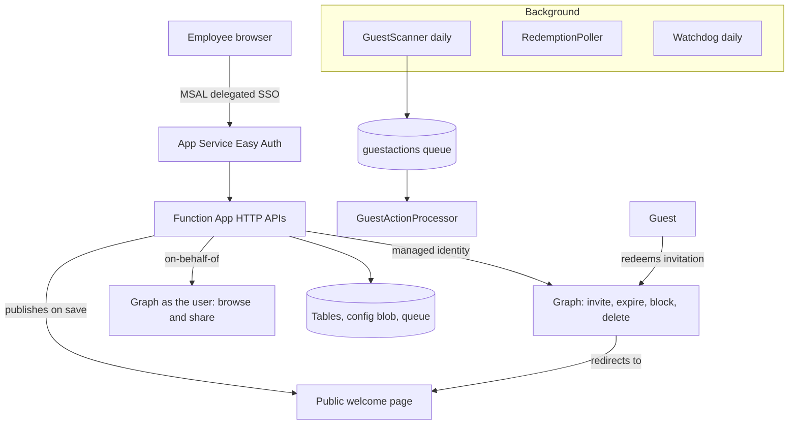

# Architecture

Collaborate is a PowerShell **Azure Functions** app (Flex Consumption) with a
static portal in front of it. It authenticates with a **managed identity** for
administration, and with the **signed-in user's own delegated token** for
anything that user shares. There are no secrets or certificates anywhere,
including in the on-behalf-of flow.

## The two identities, and why

| Operation | Runs as | Why |
|---|---|---|
| Invite, write the expiry date, block sign-in, delete, send mail | The **managed identity** | Employees should not be allowed to invite guests directly. |
| Browse SharePoint and OneDrive, share a file or folder, add a guest to a Team | The **signed-in user**, through on-behalf-of | So that Graph enforces that user's real rights, keeping them form sharing something they can't access |

`Invoke-CBGraphAsUser` is the only entry point for the delegated path, so the
rule is enforced in one place.

### Secretless on-behalf-of

The on-behalf-of flow normally needs a client secret or certificate on the app
registration. Instead, the app registration carries a **federated identity
credential that trusts the Function App's managed identity**:

1. the function asks its managed identity for a token whose audience is
   `api://AzureADTokenExchange`;
2. it presents that as the `client_assertion` in the on-behalf-of token request,
   along with the user's own token as the `assertion`;
3. Entra returns a Graph token carrying that user's delegated permissions.

Nothing is stored, so nothing can leak or expire unnoticed. 

## Where state lives

| Store | Key | Contents |
|---|---|---|
| `Guests` (table) | owner object id (or `orphaned`) / guest object id | One row per guest: owner, reason, expiry, state, reminders sent, what has been shared with them |
| `ActivityLog` (table) | `log` / (maxTicks - now) | Chronological audit feed. Employees see their own slice, administrators see everything |
| `FunctionHeartbeats` (table) | `fn` / function name | Last run, status, duration and error per function, for the Diagnostics tab |
| `SafetyState` (table) | `flag`/`count`/`meta` | Storm-guard latch, per-action daily counters, guest population |
| `config.json` (blob) | - | Everything an administrator edits: branding, policy, sharing gates, safety limits, every email template |
| `config.previous.json` (blob) | - | The version before the last save, for a one-file rollback |
| `branding/<logo>` (blob) | - | The master copy of the logo. The public site holds a mirror |

Guests are partitioned by owner. The daily scanner loads the whole table once and joins it in memory
against the guest list from Graph, which is far cheaper than a lookup per guest
and keeps the schema to one table.

Only two states are stored decisions: `blocked` and `deleted`, meaning something
was done to the account. Everything else (`pending`, `active`, `expiring`,
`expired`) is derived from the end date and the reminder window every time a row
is read, so a record can never disagree with its own end date merely because a
scan has not run yet. `Get-CBEffectiveGuestState`  decides.

**Whether somebody accepted is a separate fact from whether their access is
live**, and the two are not folded together. Entra's
`externalUserState` is `PendingAcceptance`, `Accepted`, or nothing, and
nothing is normal for an older guest. `Get-CBRedemptionState` has
three answers, the third being `unknown`; a successful sign-in settles it.

Dates are UTC calendar dates, not timestamps: access runs to the end of the day
written on the guest object. Nothing in the tool does arithmetic on local time.

**The expiry date is not only in the table.** It is written onto the guest object
itself, in a configurable `extensionAttribute`. That means it shows up in the Entra portal, and can drive dynamic groups or
Conditional Access. The setup wizard refuses an attribute that is already in use
for something else.

## The three storage accounts

They are deliberately asymmetric, for maximum security.

| Account | Public | Managed identity access | Reasoning |
|---|---|---|---|
| `cbstate<suffix>` | no | full data plane | Holds guest records and configuration. Never public. |
| `cbweb<suffix>` | no, IP-restricted | **none** | Serves the signed-in portal. A rewrite here could harvest admin sessions, so only the deploy script writes to it, at admin time. |
| `cbland<suffix>` | yes | write | The welcome page guests land on. No authentication, no tokens, no data. The worst a compromise could do is deface an unauthenticated page. |

The public account has blob
versioning and soft delete on, logs data-plane writes to Log Analytics, and the
Watchdog re-hashes the published page daily against the hash the app recorded
when it last wrote it. `Update-Collaborate.ps1` re-renders it from source, which
doubles as the recovery path.

## The public welcome page

External people never reach the portal. After redeeming an invitation they land
on a single self-contained HTML page: inline CSS, no network calls, no forms, and
a restrictive `Content-Security-Policy`. Its only dynamic behaviour is reading a
target link out of the query string.

That target is validated against a **host allowlist baked into the page** (the
tenant's SharePoint and OneDrive hosts, resolved from Graph, plus Teams, My Apps,
and anything an administrator added). Anything else is dropped and the page still
renders its welcome text. This is what stops the page becoming an open redirect
on a company-adjacent URL. The same check runs server side, in
`Get-CBWelcomeUrl`, before a target is put into an invitation.

## The lifecycle: decide, then act

The daily scanner **decides and never acts**. Everything it finds becomes one
queue message per guest, which `GuestActionProcessor` carries out. Three reasons: one bad guest record cannot stop a run, each item gets its own
retries and a poison queue, and the storm guard can refuse work item by item so a
breach pauses the tool partway through rather than after it has acted on
everybody.

The processor **re-reads the record and recomputes the decision before acting**.
A queued message is a suggestion, not an instruction. Between the scan and the
moment the message is picked up, the owner may have extended the access or the
guest may have been removed, and acting on the message as written would undo a
person's decision with a stale instruction.

`Get-CBLifecycleAction` is the single decision function. It reads
a row and a calendar and returns exactly one of `none`, `remind`, `block` or
`delete`.

### Reminders fire once

Steps are "days before the end date", and reaching a step consumes every wider
step at the same time. Without that, a guest invited for five days has already
passed the 30-day and 7-day marks the moment they are created, and would be
mailed about the 30-day mark today and the 7-day mark tomorrow for access that
ends on Friday. Three configured steps produce three reminders over a
guest's whole lifetime, whatever order the scanner happens to run in.

The step is recorded as spent even when the mail could not be sent.

### Nothing is irreversible in one step

| Stage | What happens | Reversible by |
|---|---|---|
| End date reached | Sign-in switched off, sessions revoked where permitted, grace period starts, owner told with the removal date | Extending, in the portal |
| Grace lapses | Account deleted, owner told | Extending, for 30 days, via the Entra recycle bin |

A blocked record with no grace date recorded is left alone rather than deleted.

## Safety

Every destructive action passes through a **storm guard**: per-action daily caps
(invitations, blocks, deletions) plus a percent-of-guest-population ceiling. On a
breach the tool pauses all processing, holds queued work with a
visibility delay, and raises a "review and resume" banner. There is a separate
per-employee invitation limit, because invitations are the only action ordinary
users trigger.

A new install starts in **simulation mode**: everything is read and logged, and
nothing is changed or sent, until an administrator turns it off.

Expiry never deletes immediately. It blocks sign-in first, mails both parties,
and only deletes once the configurable grace period lapses, so a wrong date is
recoverable.
